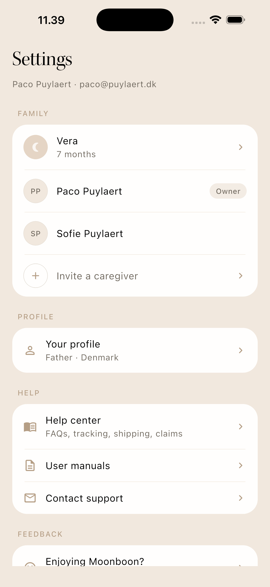
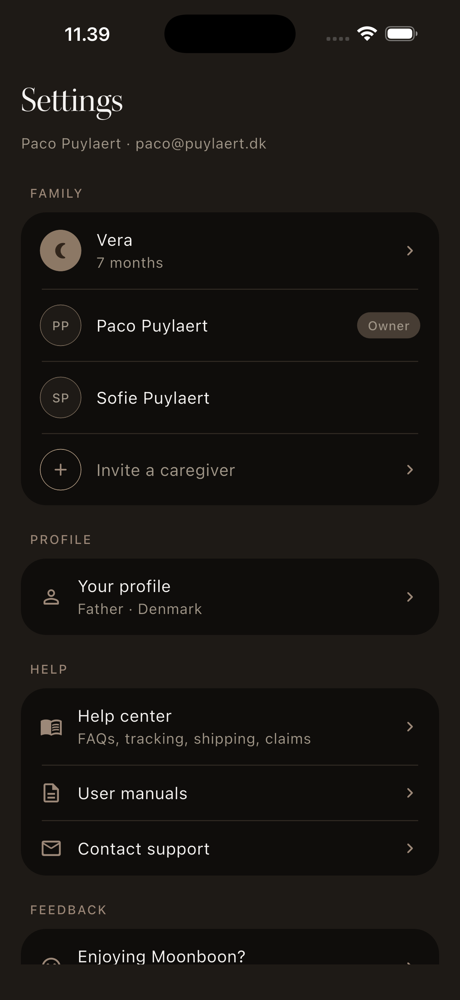
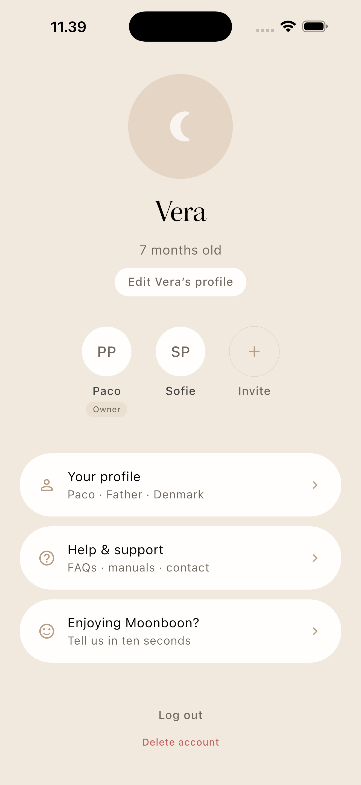
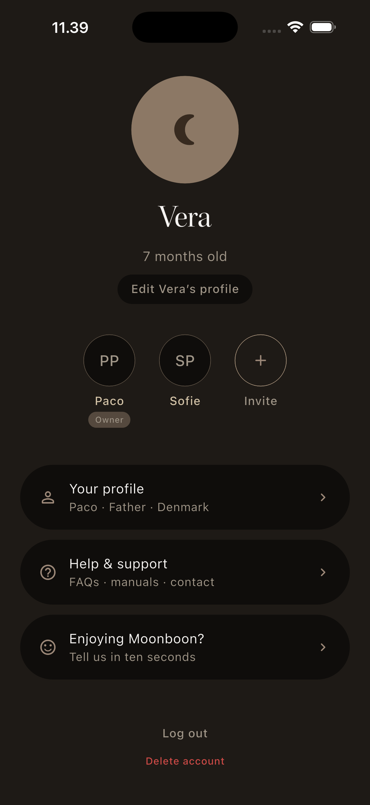
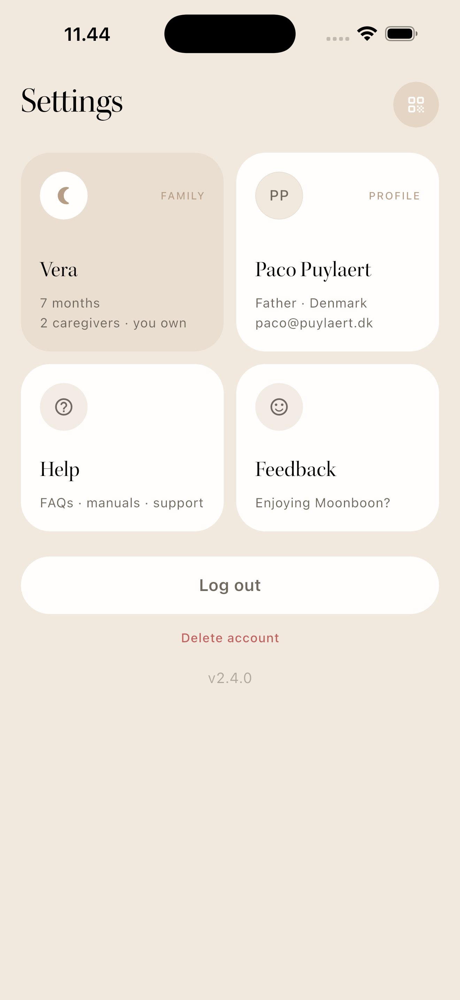
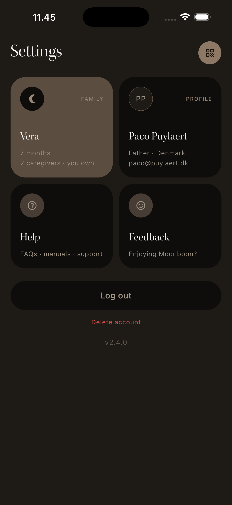
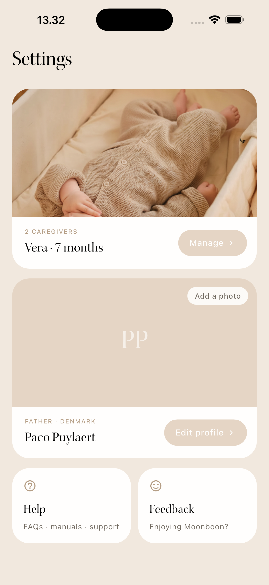
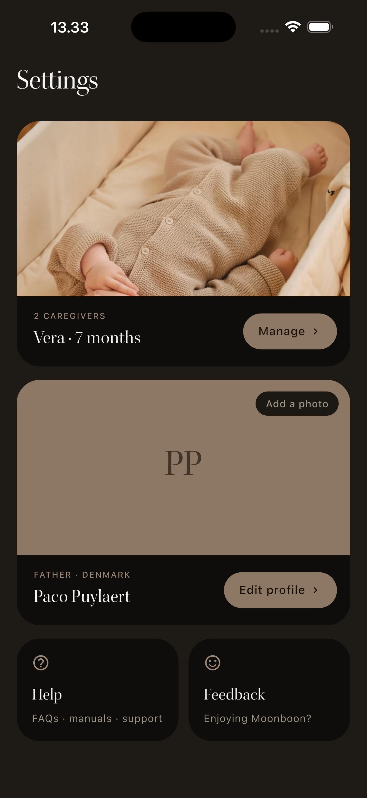
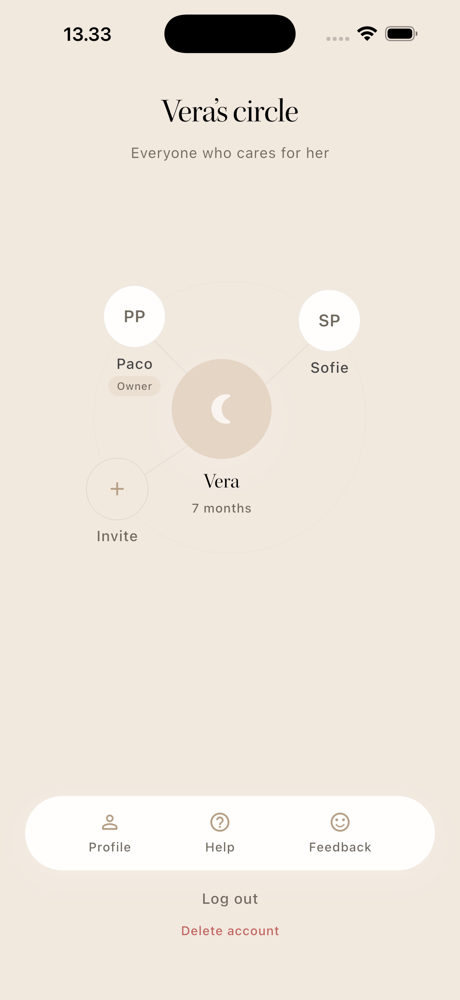
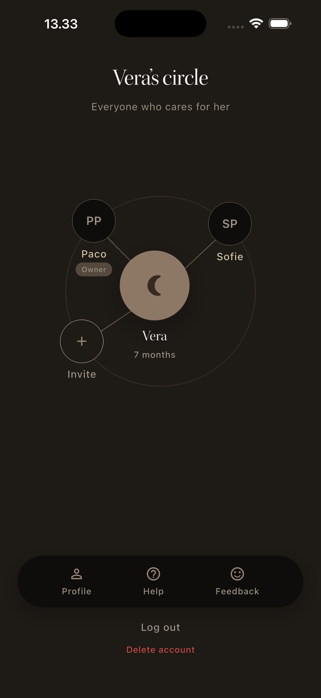

# Coffee Deck — Revised Settings

**Ticket:** [CU-86cavd37q — Revised settings](https://app.clickup.com/t/86cavd37q) · priority high · list "Ready"
**Branch:** `prototype/CU-86cavd37q-settings` · variants in `lib/variants/settings/`

## The problem (restated)

Settings is outdated: newly introduced profile fields (country, role) aren't editable, and
there is no way to manage the family at all. The redesign must let parents (1) view/edit
their own profile, (2) view/edit the baby and manage family members (owner invites/removes),
(3) reach help fast, and (4) give lightweight feedback — while every legacy setting
(notifications, appearance, language, …) is deprecated and removed.

## Hard constraints

- **Profile:** first/last name, country, role visible + editable; email visible but read-only. Log out / delete account with today's confirmation pattern.
- **Family:** baby name, age, picture (placeholder if unset) visible to owner AND non-owner; both can edit baby fields. Member list shows everyone + owner status; solo family shows just me (no "and 0 others"). Invite entry point owner-only; removal needs confirmation.
- **Family empty state:** two entry points — "Add a baby" and "Request access".
- **Help:** FAQs / tracking / shipping / claims links, user manuals, contact support (email).
- **Feedback:** "Enjoying Moonboon?" entry point; sheet logic unchanged.
- **Deprecated:** no notifications / appearance / language / haptics settings anywhere.
- **A11y:** destructive actions clearly announced and confirmable.

## Success criteria

Fewer CX tickets about poor UX managing the Moonboon journey → proxies for the deck:
**findability** (can I locate profile/family/help in <2s), **family legibility** (who has
access, who owns, who's the baby — at a glance), **calm** (feels Moonboon, not a settings
dump), **editability** (obvious path to change what's now read-only in prod).

## Stated assumptions

- The overview screen is the design battleground; edit flows (profile form, baby form, invite QR) reuse one shared pattern per variant and are mocked one level deep at most.
- "Role" = parenting role (Mother/Father/Guardian) from the new sign-up flow.
- Mock family: Paco (owner, Father, Denmark) + Sofie (member); baby **Vera, 7 months**, no picture set → placeholder is a first-class design element.
- Device management stays on the Devices tab (ticket §7 open question — answered "no" for these prototypes; worth 2 min at coffee).
- The mp4 attachment is an animated PRD walkthrough with no design direction (per Paco) — not used.

---

## Theses

_To be judged side-by-side below; each commits to a different structural archetype._

### V1 — The Calm Index · _stacked list_
**Bet:** parents come to Settings to get out fast — one serene, grouped list with the baby pinned on top beats any clever layout. Optimizes findability + zero learning curve. Sacrifices emotion and any sense that Family is the star.

### V2 — Family First · _hero + actions_
**Bet:** this screen is really the family's home — Vera as the emotional hero, caregivers as an avatar constellation right under her, and everything else (profile, help, feedback) demoted to quiet pills below. Optimizes family legibility + warmth. Sacrifices profile/help prominence — support-seekers scroll.

### V3 — The Glance Board · _dashboard tiles_
**Bet:** settings should answer before you tap — live-content tiles (your name on Profile, Vera + caregiver count on Family, support routes on Help) make the overview a status board. Optimizes one-tap access + scalability if Settings grows. Sacrifices calm; densest of the five.

### V4 — The Album · _full-bleed imagery cards_
**Bet:** extend the Devices-page photographic language to people — full-bleed warm imagery cards ("Your family", "You") with white bottom bands and pill actions, so Settings feels like a family album, not admin. Optimizes brand continuity + feeling. Sacrifices density and depends on photo quality (placeholder day-one reality).

### V5 — The Constellation · _spatial map_
**Bet:** a family is a structure, not a list — draw it: Vera at the center, caregivers orbiting on hairline threads, owner marked; utilities live in a floating pill dock. Optimizes instant comprehension of who-has-access + memorability. Sacrifices convention and scales poorly past ~4 members (in scope: max 2 today).

---

## Variants

### V1 — The Calm Index · stacked list

| Light | Dark |
|---|---|
|  |  |

- **The bet:** get in, change it, get out — a serene grouped index with Vera pinned on top.
- **Optimizes:** findability (everything above the fold), zero learning curve, easiest to ship.
- **Sacrifices:** emotion; Family reads as one group among four, not the star.
- **Open questions for PM:** is "boring but instant" the right personality for Settings, given the rest of the app leans warm? Should the member rows expand inline or push to a family page?

### V2 — Family First · hero + actions

| Light | Dark |
|---|---|
|  |  |

- **The bet:** Settings is secretly the family's home — Vera as emotional hero, caregivers right under her, utilities demoted to quiet pills.
- **Optimizes:** family legibility + warmth; the invite entry point is impossible to miss.
- **Sacrifices:** profile/help prominence — a support-seeking parent scans past the hero first.
- **Open questions for PM:** does Help deserve this demotion given the success metric is fewer CX tickets? Where does the empty state ("Add a baby" / "Request access") replace the hero?

### V3 — The Glance Board · dashboard tiles

| Light | Dark |
|---|---|
|  |  |

- **The bet:** answer before the tap — tiles carry live content (your name, Vera + caregiver count) so the overview is a status board.
- **Optimizes:** one-tap access to all four areas at once; scales cleanly if Settings grows.
- **Sacrifices:** calm — densest of the five; tiles equalize Family and Feedback in visual weight.
- **Open questions for PM:** is the QR page-action (invite shortcut) too cryptic in the corner? Do equal-weight tiles undersell the family?

### V4 — The Album · full-bleed imagery cards

| Light | Dark |
|---|---|
|  |  |

- **The bet:** extend the Devices-page photographic language to people — Settings feels like a family album, not admin.
- **Optimizes:** brand continuity (strongest "feels Moonboon" of the five), makes adding a photo desirable — both card states are shown: warm photo (Vera) and first-class initials placeholder with "Add a photo" chip (You).
- **Sacrifices:** density (two cards fill the viewport; Help/Feedback/log-out scroll) and lives or dies by photo quality.
- **Open questions for PM:** is a 2-screen-tall Settings acceptable? Do we prompt for a baby photo during onboarding to guarantee the album pays off day one?

### V5 — The Constellation · spatial map

| Light | Dark |
|---|---|
|  |  |

- **The bet:** a family is a structure, not a list — draw it. Vera at the center, caregivers on hairline threads, owner chip visible, invite as an empty orbit slot.
- **Optimizes:** instant who-has-access comprehension + memorability; the most differentiated Settings screen on the market.
- **Sacrifices:** convention (edit affordances are non-obvious), scales poorly past ~4 members, and demotes profile/help into a dock.
- **Open questions for PM:** does this earn its novelty, or is it a family-page pattern rather than the Settings root? (Log out / delete account now live under the dock; version number still homeless.)

---

## Comparison

| | Findability | Family legibility | Calm | Editability | Effort to ship |
|---|---|---|---|---|---|
| **V1 Calm Index** | ●●● | ●○○ | ●●○ | ●●● | lowest |
| **V2 Family First** | ●●○ | ●●● | ●●● | ●●○ | low |
| **V3 Glance Board** | ●●● | ●●○ | ●○○ | ●●○ | low |
| **V4 Album** | ●●○ | ●●○ | ●●● | ●●● | medium (photo pipeline) |
| **V5 Constellation** | ●○○ | ●●● | ●●● | ●○○ | highest |

## Recommendation

**V2 (Family First), stealing V4's album card as the Vera hero.** Reasoning: the ticket's
core new capability is family management, and the success metric is fewer confused-parent
CX tickets — V2 makes who-has-access and how-to-invite legible in one glance without
V5's convention risk. It's also the layout that best matches the SISU design language
(one idea per screen, generous air, pill actions). V4 is the strongest *brand* statement
but stakes the day-one experience on a photo most users won't have set yet; as a card
*inside* V2 it gives the same warmth with a graceful placeholder. V1 is the safe fallback
if scope pressure hits. V3 and V5 are worth the coffee conversation but I wouldn't ship
either as the Settings root.

_Next step after decision: `/prototype decide` → Figma translation (pipeline step ②)._
